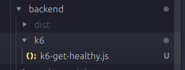
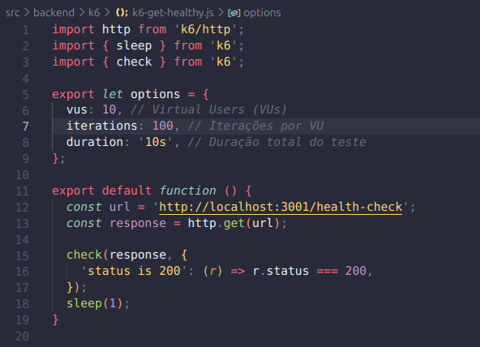
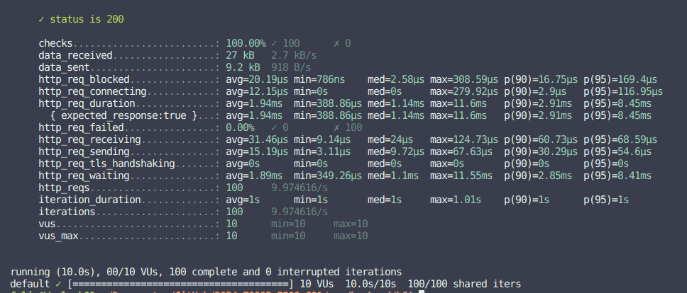

# Avaliando a performance da minha aplicação com K6

___O código usado foi o repositório do projeto do Grupo 1 (main)___

A realização de testes de carga é um componente essencial no processo de desenvolvimento de aplicações web, permitindo a detecção proativa e a resolução de problemas de desempenho antes que eles afetem a experiência do usuário final. Aproveitar o K6 simplifica esse processo, oferecendo uma solução robusta e adaptável para simular diversos padrões de uso e avaliar a eficiência do aplicativo.

O K6 por sua vez representa uma solução projetada especificamente para realizar testes de carga, desempenho e estresse. Ao permitir a replicação de vários usuários acessando um aplicativo simultaneamente, facilita a detecção de possíveis gargalos e problemas de desempenho em sistemas web.

## Utilizando o K6

Primeiramente é preciso criar um novo arquivo para testar o k6, no caso chamado de k6-get-healthy.js. O arquivo fica dentro da pasta k6 no diretório do back-end.

O código realiza testes de carga em um endpoint /health-check em um localhost na porta 3001

**Configuração de Opções:**

São definidas as opções de execução do teste, como o número de usuários virtuais (vus), o número de iterações por usuário virtual (iterations) e a duração total do teste (duration).

**Função de Teste:**

O código executa 10 usuários virtuais, cada um realizando 100 iterações do teste, durante um período de 10 segundos. Cada usuário faz uma requisição GET ao endpoint de saúde e verifica se a resposta possui um código de status 200.

### Métricas

Com o código feito, é preciso rodar o arquivo pelo trerminal usando o comando `k6 run k6-get-healthy.js`. Ao fazer isso, ele execulta o(s) teste(s) e retorna as métricas coletadas

* **data_received:** Esta métrica indica a quantidade total de dados recebidos durante o teste, medida em kilobytes (kB). No caso apresentado, foram recebidos 27 kB de dados a uma taxa de 2.7 kB/s.

* **data_sent:** Indica a quantidade total de dados enviados durante o teste, também medida em kilobytes (kB). Foram enviados 9.2 kB de dados a uma taxa de 918 bytes por segundo (B/s).

* **http_req_blocked:** Esta métrica refere-se ao tempo médio que as requisições HTTP ficaram bloqueadas antes de serem enviadas. É medido em microssegundos (µs). No exemplo, a média foi de 20.19µs, com o mínimo de 786 nanossegundos (ns) e o máximo de 308.59µs.

* **http_req_connecting:** Indica o tempo médio que as conexões levaram para serem estabelecidas. Também é medido em microssegundos (µs). A média foi de 12.15µs, com um mínimo de 0s (sem tempo de conexão), e um máximo de 279.92µs.

* **http_req_duration:** Esta métrica representa a duração média das requisições HTTP, desde o início até o fim, incluindo o tempo de espera pelo servidor. No exemplo, a média foi de 1.94 milissegundos (ms), com um mínimo de 388.86µs e um máximo de 11.6ms.

* **http_req_failed:** Indica a porcentagem de requisições HTTP que falharam durante o teste. No exemplo, não houve falhas, pois a porcentagem é 0.00%.

* **http_req_waiting:** Representa o tempo médio que as requisições esperaram para receber a primeira byte de resposta do servidor, após a conexão ser estabelecida. Medido em milissegundos (ms), a média foi de 1.89ms, com um mínimo de 349.26µs e um máximo de 11.55ms.
